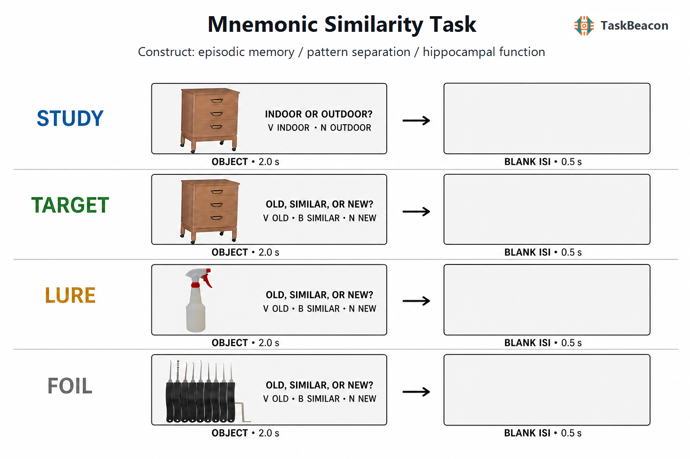

# Mnemonic Similarity Task

| Field | Value |
|---|---|
| Name | Mnemonic Similarity Task |
| Version | 0.1.0 |
| URL / Repository | https://github.com/TaskBeacon/T000078-mnemonic-similarity-task |
| Short Description | Classic two-phase object mnemonic-discrimination task |
| Created By | TaskBeacon |
| Date Updated | 2026-07-27 |
| PsyFlow Version | Current local runtime |
| PsychoPy Version | Current local runtime |
| Modality | Behavioral |
| Language | Chinese |

## 1. Task Overview

The Mnemonic Similarity Task (MST) measures episodic-memory precision and mnemonic discrimination. It modifies object-recognition memory by adding perceptually similar lure items, making performance sensitive to hippocampal pattern-separation function.

The primary outcome is the Lure Discrimination Index:

`LDI = P("Similar" | Lure) - P("Similar" | Foil)`

Corrected recognition is:

`REC = P("Old" | Target) - P("Old" | Foil)`

## 2. Task Flow



### Block-Level Flow

The task contains two sequential blocks. During incidental study, 128 object images are shown and participants classify each as indoor or outdoor. Immediately afterward, a surprise recognition test presents 192 images: 64 exact targets, 64 paired similar lures, and 64 unseen foils.

### Trial-Level Flow

Each trial displays one central object for 2.0 s followed by a 0.5 s blank inter-stimulus interval. Study responses use `V=indoor` and `N=outdoor`. Test responses use `V=old`, `B=similar`, and `N=new`.

The session generator preserves global pair constraints: target IDs are studied and repeated as the same `a` photograph; lure IDs are studied as `a` and tested as paired `b`; foil IDs are never studied. Target, lure, and foil ID sets are disjoint.

### Controller Logic

No adaptive controller is used. The L1–L5 lure bins are balanced during lure selection, and all condition identities are preplanned from the configured seed.

## 3. Configuration Summary

### a. Subject Info

The participant form collects a string participant identifier.

### b. Window Settings

| Category | Setting |
|---|---|
| Subject | String participant ID |
| Window | 1280 × 800, degree units, white background |

### c. Stimuli

| Category | Setting |
|---|---|
| Stimuli | Official Stark Lab Set 1 paired object photographs |
| Full counts | 128 study trials; 192 test trials |
| Test balance | 64 targets; 64 lures; 64 foils |

### d. Timing

| Category | Setting |
|---|---|
| Object duration | 2.0 s |
| ISI | 0.5 s |
| Study keys | V indoor; N outdoor |
| Test keys | V old; B similar; N new |
| Seed | 78078, same across participants |

| Trigger | Code |
|---|---:|
| Experiment start / end | 1 / 99 |
| Study image / timeout | 20 / 23 |
| Target / lure / foil | 30 / 31 / 32 |
| Old / similar / new response | 40 / 41 / 42 |
| Test timeout / ISI | 43 / 50 |
| Block start / end | 10 / 90 |

Run modes:

```powershell
python main.py human
python main.py qa
python main.py sim --config config/config_scripted_sim.yaml
python main.py sim --config config/config_sampler_sim.yaml
```

## 4. Methods (for academic publication)

Participants completed the classic two-phase Mnemonic Similarity Task. During incidental encoding, 128 photographs of everyday objects were shown in random order, and participants classified each object as typically indoor or outdoor. The subsequent surprise recognition test presented 192 photographs in random order: one third were exact repetitions of studied objects (targets), one third were perceptually similar but nonidentical paired objects (lures), and one third were novel objects (foils). Participants classified test images as old, similar, or new. Each object was displayed for 2.0 s and followed by a 0.5-s blank interval. The Lure Discrimination Index was computed as the proportion of similar responses to lures minus the proportion of similar responses to foils. Corrected recognition was computed as the proportion of old responses to targets minus the proportion of old responses to foils.

The implementation uses Set 1 from the official Stark Lab MST distribution, including its empirical five-bin lure-similarity metadata. Selected literature and complete parameter/stimulus traceability are available under `references/`.
